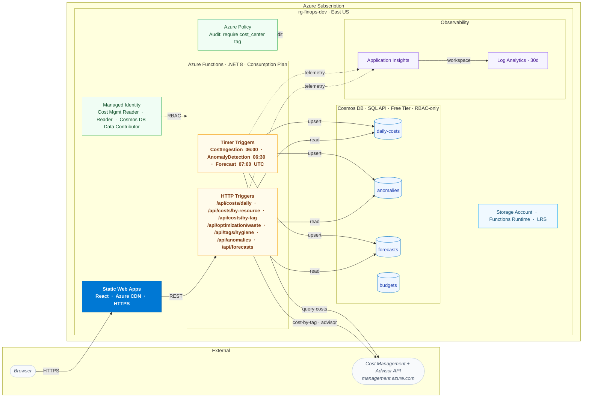

# Azure FinOps Cost Visibility Dashboard

[](https://github.com/jordann6/azure-finops-dashboard/actions/workflows/validate.yml)

Portfolio project demonstrating cloud financial operations on Azure. Covers cost visibility, cost allocation by tag (chargeback), Azure Advisor cost optimization, tagging hygiene, Azure Policy tag governance, anomaly detection, budget forecasting, and a React dashboard for visualization.

## Architecture




Timer triggered Azure Functions (C# .NET 8 isolated worker) ingest cost data from the Azure Cost Management REST API on a daily schedule, write normalized records to Cosmos DB, then run anomaly detection (z score based) and linear regression forecasting against the stored data. HTTP triggered Functions expose a REST API consumed by a React single page application hosted on Azure Static Web Apps.

All infrastructure is defined in Terraform with remote state in Azure Storage.

### Components

**Data Pipeline**
Cost ingestion runs daily at 06:00 UTC, pulling the previous 7 days of actual cost data grouped by resource, resource type, and resource group. Records are upserted into Cosmos DB keyed by resource ID.

**Anomaly Detection**
Runs at 06:30 UTC. Calculates rolling 30 day mean and standard deviation per resource. Flags any resource whose latest daily cost exceeds 2 standard deviations from the mean. Severity tiers: Low (2.0+ sigma), Medium (2.5+ sigma), High (3.0+ sigma).

**Forecasting**
Runs at 07:00 UTC. Computes a 14 day cost projection using linear trend estimation over the trailing 30 day window, with confidence intervals derived from historical variance. Requires a minimum of 7 days of data.

**Cost Allocation by Tag (chargeback)**
A live Cost Management query groups the last 30 days of spend by a cost allocation tag (default `project`) so the dashboard answers "what does each project/owner cost," not just "what does each resource cost." Untagged spend is surfaced under `(untagged)`, making unallocated cost visible.

**Optimization (Azure Advisor)**
Reads Azure Advisor cost recommendations (idle/underused resources, right-sizing, reservation purchases), each with an estimated monthly saving, and totals the savings left on the table. This is the Azure-native equivalent of scanning for unattached disks and idle public IPs plus reservation coverage.

**Tag Hygiene**
Evaluates all subscription resources against a required tag policy (project, environment, owner, cost_center). Reports compliance percentage and surfaces specific resources with missing tags.

**Tag Governance (Azure Policy)**
A custom Azure Policy definition audits every taggable resource for the `cost_center` tag, assigned at resource-group scope. It uses the **Audit** effect (not Deny/Modify) so it flags non-compliance in the Policy compliance view without blocking or auto-fixing the intentionally-untagged demo resource. This is the control-plane governance layer that complements the after-the-fact Tag Hygiene report.

**REST API**
Seven HTTP endpoints exposed via Azure Functions: /api/costs/daily, /api/costs/by-resource, /api/costs/by-tag, /api/optimization/waste, /api/tags/hygiene, /api/anomalies, /api/forecasts. All return JSON with CORS headers for frontend consumption.

**Frontend**
React SPA with Recharts visualizations. Tabbed interface covering daily cost trends (bar chart), cost breakdown by resource (pie chart and table), spend by owner (tag-grouped bar chart), optimization recommendations, tag compliance metrics, anomaly findings, and forecast projections with confidence bands.

## Tech Stack

Azure Functions (C# .NET 8, isolated worker), Cosmos DB (SQL API, free tier), Azure Cost Management REST API, Application Insights, Log Analytics, Azure Static Web Apps, React, Recharts, Terraform (remote state in Azure Storage)

## Infrastructure

3 reusable Terraform modules under `terraform/modules/`, composed by the `terraform/envs/dev/` environment configuration.

| Component | Resources |
|---|---|
| Backend | Azure Storage account for Terraform remote state (configured in `backend.tf`) |
| Sample Workload | 2 storage accounts (1 tagged, 1 intentionally untagged), Log Analytics workspace |
| Cosmos DB | Account (free tier), SQL database, 4 containers (daily costs, anomalies, forecasts, budgets) |
| Functions | Consumption plan, Function App with system-assigned managed identity, Functions storage account, Application Insights |
| Governance | Custom Azure Policy definition (Audit: require `cost_center` tag) + resource-group assignment |
| Budget | Subscription consumption budget with Monitor action group (80% forecast / 100% actual email alerts) |

### RBAC and Security

The Function App uses a system-assigned managed identity with three role assignments: Cost Management Reader (subscription scope) for cost and Advisor data access, Reader (subscription scope) for resource metadata, tag evaluation, and Advisor recommendations, and Cosmos DB Built-in Data Contributor (database scope) for data plane operations.

Additional hardening applied:

- `local_authentication_disabled = true` on the Cosmos DB account — key-based and connection-string auth is disabled at the account level; only RBAC data plane access is accepted
- `https_traffic_only_enabled = true` and `allow_nested_items_to_be_public = false` on the Functions storage account
- CORS origin configurable via `CORS_ALLOWED_ORIGIN` app setting (set to the Static Web Apps URL after deployment)
- Subscription ID managed as a Terraform input variable — not hardcoded in source

## Project Structure

```
azure-finops-dashboard/
  terraform/
    envs/dev/            # Environment configuration and backend.tf
    modules/
      sample_workload/   # Resources generating cost signal
      cosmos/            # Cosmos DB account, database, containers
      functions/         # Function App, App Service Plan, RBAC, App Insights
  functions/
    src/
      Models/            # CostRecord, AnomalyRecord, ForecastRecord, TagHygieneResult
      Services/          # CosmosService, CostIngestionService, AnomalyDetectionService, ForecastService, TagHygieneService
      Functions/         # Timer and HTTP triggered function classes
  frontend/
    finops-dashboard/    # React SPA with Recharts
```

## Local Development

### Prerequisites

.NET 8 SDK, Node.js 20+, Terraform 1.6+, Azure CLI, Azure Functions Core Tools

### Functions

```
cd functions/src
dotnet build
func start
```

### Frontend

```
cd frontend/finops-dashboard
npm install
REACT_APP_API_BASE=http://localhost:7071/api npm start
```

## Deployment

```
cd terraform/envs/dev
terraform init
terraform plan -out tf.plan
terraform apply tf.plan
```

Deploy Functions:

```
cd functions/src
func azure functionapp publish <function-app-name>
```

> **Subscription prerequisite — App Service quota.** The Function App runs on a Linux Consumption (`Y1`) plan, which needs App Service compute quota. Some subscriptions (free/sponsored) have a **"Total VMs" quota of 0**, in which case `terraform apply` fails on the service plan with `401 ... Operation cannot be completed without additional quota`. This is subscription-wide (a region change does not help); request an App Service quota increase through Azure support before deploying. The rest of the stack (resource group, Cosmos, storage, Log Analytics, budget, and the Azure Policy governance layer) deploys independently of this.

## FinOps Principles Demonstrated

**Visibility**: Daily cost ingestion with resource level granularity, breakdown by resource type and resource group

**Cost Allocation**: Spend grouped by cost allocation tag (chargeback view), with unallocated/untagged spend made explicit

**Tagging Governance**: Two layers, control-plane and reporting, an Azure Policy Audit assignment that flags resources missing the `cost_center` tag, plus automated compliance scanning that surfaces untagged resources with specific missing tag details

**Cost Optimization**: Azure Advisor cost recommendations (idle resources, right-sizing, reservations) surfaced with estimated monthly savings

**Anomaly Detection**: Statistical outlier identification using z score analysis, severity tiering, historical deviation tracking

**Forecasting**: Trend based cost projection with confidence intervals, enabling proactive budget planning

## Status

Code complete. Infrastructure has been torn down after documentation (same pattern as other portfolio projects). All Terraform modules are ready for redeployment.