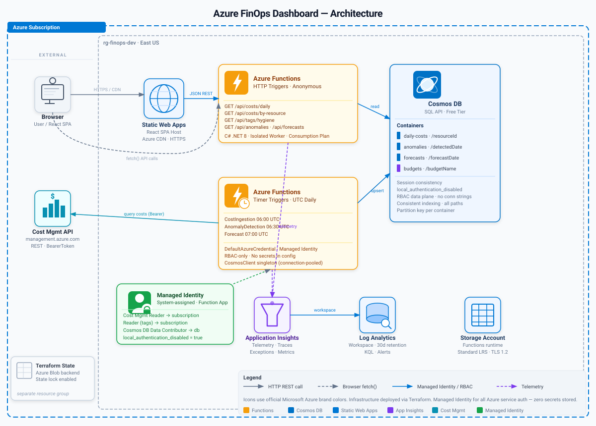

# Azure FinOps Cost Visibility Dashboard

Portfolio project demonstrating cloud financial operations on Azure. Covers cost visibility, tagging hygiene enforcement, anomaly detection, budget forecasting, and a React dashboard for visualization.

## Architecture



Timer triggered Azure Functions (C# .NET 8 isolated worker) ingest cost data from the Azure Cost Management REST API on a daily schedule, write normalized records to Cosmos DB, then run anomaly detection (z score based) and linear regression forecasting against the stored data. HTTP triggered Functions expose a REST API consumed by a React single page application hosted on Azure Static Web Apps.

All infrastructure is defined in Terraform with remote state in Azure Storage.

### Components

**Data Pipeline**
Cost ingestion runs daily at 06:00 UTC, pulling the previous 7 days of actual cost data grouped by resource, resource type, and resource group. Records are upserted into Cosmos DB keyed by resource ID.

**Anomaly Detection**
Runs at 06:30 UTC. Calculates rolling 30 day mean and standard deviation per resource. Flags any resource whose latest daily cost exceeds 2 standard deviations from the mean. Severity tiers: Low (2.0+ sigma), Medium (2.5+ sigma), High (3.0+ sigma).

**Forecasting**
Runs at 07:00 UTC. Computes a 14 day cost projection using linear trend estimation over the trailing 30 day window, with confidence intervals derived from historical variance. Requires a minimum of 7 days of data.

**Tag Hygiene**
Evaluates all subscription resources against a required tag policy (project, environment, owner). Reports compliance percentage and surfaces specific resources with missing tags.

**REST API**
Five HTTP endpoints exposed via Azure Functions: /api/costs/daily, /api/costs/by-resource, /api/tags/hygiene, /api/anomalies, /api/forecasts. All return JSON with CORS headers for frontend consumption.

**Frontend**
React SPA with Recharts visualizations. Tabbed interface covering daily cost trends (bar chart), cost breakdown by resource (pie chart and table), tag compliance metrics, anomaly findings, and forecast projections with confidence bands.

## Tech Stack

Azure Functions (C# .NET 8, isolated worker), Cosmos DB (SQL API, free tier), Azure Cost Management REST API, Application Insights, Log Analytics, Azure Static Web Apps, React, Recharts, Terraform (remote state in Azure Storage)

## Infrastructure

9 Terraform modules across backend, sample workload, Cosmos DB, Functions, and observability layers.

| Module | Resources |
|---|---|
| Backend | Storage account for Terraform remote state |
| Sample Workload | 2 storage accounts (1 tagged, 1 intentionally untagged), Log Analytics workspace |
| Cosmos DB | Account (free tier), SQL database, 4 containers (daily costs, anomalies, forecasts, budgets) |
| Functions | Consumption plan, Function App with system assigned managed identity, Functions storage account, Application Insights |

### RBAC and Security

The Function App uses a system assigned managed identity with three role assignments: Cost Management Reader (subscription scope) for cost data access, Reader (subscription scope) for resource metadata and tag evaluation, and Cosmos DB Built in Data Contributor (database scope) for data plane operations. No connection strings or API keys are stored in application settings for Cosmos DB access.

## Project Structure

```
azure-finops-dashboard/
  terraform/
    envs/dev/            # Environment configuration
    modules/
      backend/           # Terraform state storage
      sample_workload/   # Resources generating cost signal
      cosmos/            # Cosmos DB account, database, containers
      functions/         # Function App, App Service Plan, RBAC
      observability/     # Application Insights, alerts
  functions/
    src/
      Models/            # CostRecord, AnomalyRecord, ForecastRecord, TagHygieneResult
      Services/          # CosmosService, CostIngestionService, AnomalyDetectionService, ForecastService, TagHygieneService
      Functions/         # Timer and HTTP triggered function classes
  frontend/
    finops-dashboard/    # React SPA with Recharts
```

## Local Development

### Prerequisites

.NET 8 SDK, Node.js 20+, Terraform 1.6+, Azure CLI, Azure Functions Core Tools

### Functions

```
cd functions/src
dotnet build
func start
```

### Frontend

```
cd frontend/finops-dashboard
npm install
REACT_APP_API_BASE=http://localhost:7071/api npm start
```

## Deployment

```
cd terraform/envs/dev
terraform init
terraform plan -out tf.plan
terraform apply tf.plan
```

Deploy Functions:

```
cd functions/src
func azure functionapp publish <function-app-name>
```

## FinOps Principles Demonstrated

**Visibility**: Daily cost ingestion with resource level granularity, breakdown by resource type and resource group

**Tagging Governance**: Automated compliance scanning against required tag policies, surfacing untagged resources with specific missing tag details

**Anomaly Detection**: Statistical outlier identification using z score analysis, severity tiering, historical deviation tracking

**Forecasting**: Trend based cost projection with confidence intervals, enabling proactive budget planning

## Status

Code complete. Infrastructure has been torn down after documentation (same pattern as other portfolio projects). All Terraform modules are ready for redeployment.