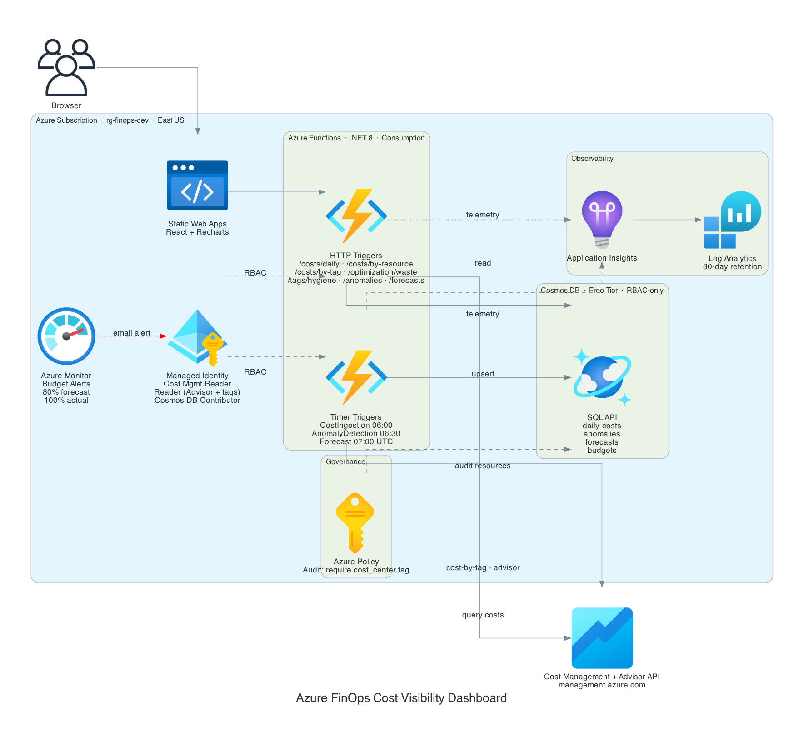

# Case Study: Azure FinOps Cost Visibility Dashboard

## Problem

Cost visibility on Azure has the same gap as anywhere else: it is easy to see
spend by resource, and hard to see spend by owner, waste, and governance. Azure
also has its own tagging quirk, tags do not inherit from a resource group to its
children by default, so untagged resources are common and cost allocation breaks
quietly.

This project is a self-hosted FinOps dashboard on Azure that ingests Cost
Management data, and layers on the controls a FinOps practice needs: cost
allocation by tag, Azure Advisor optimization, tag hygiene reporting, and, the
piece Azure does better than most clouds, tag governance enforced at the control
plane with Azure Policy.

## Architecture

C# .NET 8 isolated-worker Azure Functions on a Consumption plan. Timer triggers
ingest Cost Management data into Cosmos DB (SQL API, free tier, RBAC-only, local
auth disabled) and run anomaly detection and forecasting. HTTP triggers expose a
REST API to a React SPA. The Function App authenticates to every Azure API and to
Cosmos with a system-assigned managed identity, no keys or connection strings in
app settings. Terraform with remote state in Azure Storage; three reusable modules
composed by a dev environment.

## What was built (FinOps parallels to the AWS cost dashboard)

- **Cost allocation by tag (chargeback).** A live Cost Management query groups the
  last 30 days of spend by a cost allocation tag (default `project`), parsed
  robustly by column metadata rather than fixed indices. Untagged spend is
  surfaced under `(untagged)`.
- **Optimization via Azure Advisor.** A new `AdvisorService` reads Advisor cost
  recommendations (idle/underused resources, right-sizing, reservation purchases)
  and totals the estimated monthly savings. On Azure, Advisor already surfaces
  unattached disks and idle public IPs with a dollar figure, so it is the natural
  equivalent of a hand-rolled waste scan plus reservation coverage.
- **Tag governance with Azure Policy.** A custom policy definition audits every
  taggable resource for the `cost_center` tag, assigned at resource-group scope.
- **Cost allocation dimensions.** Added `cost_center` and `team` tags (owner is a
  person, not a billing bucket) and added `cost_center` to the required-tag set.

## The decision worth calling out: Audit, not Deny or Modify

The sample workload deliberately includes an untagged storage account so the tag
hygiene view has something to find. That made the policy effect a real design
choice:

- **Deny** would have blocked the untagged resource at `terraform apply` time,
  breaking the deploy.
- **Modify / Inherit** would have auto-tagged it, erasing the hygiene demo.
- **Audit** flags it as non-compliant in the Policy compliance view while leaving
  it exactly as-is.

Audit was the right call: it demonstrates control-plane governance without
fighting the reporting layer it complements. The Function-based scanner reports
after the fact; Azure Policy governs continuously. Showing both, and knowing why
they are different, is the point.

## Validation and the constraint that stopped a full deploy

The governance layer was deployed and demoed live: the policy assignment "Audit
missing cost_center tag" was created, resources carried the new `cost_center`
and `team` tags, and the intentionally-untagged storage account showed no tags,
exactly what the policy and the hygiene scanner flag. The stack was then
destroyed cleanly.

The Function App itself could not be deployed in this environment: the Azure
subscription has an App Service "Total VMs" quota of **0**, so the Consumption
plan fails with `401 ... Operation cannot be completed without additional quota`.
This is a subscription-wide limit (a region change does not help) and requires an
Azure support quota increase. The two Function-hosted features (cost-by-tag and
Advisor) are implemented and build clean (`dotnet build`, 0 warnings), and the
equivalent pattern is proven end-to-end on the AWS sibling project; they run once
the quota is granted.

## Result

A FinOps dashboard that answers ownership, waste, and governance, not just
spend-by-resource, built with keyless managed-identity auth throughout and
governance enforced at the Azure control plane. The most instructive part was
the policy-effect decision: on Azure, the interesting FinOps work is as much
about governing tags before the fact as reporting on them after.
